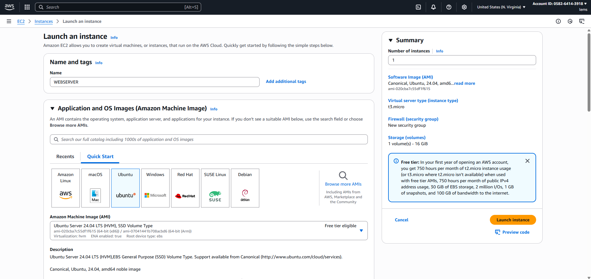
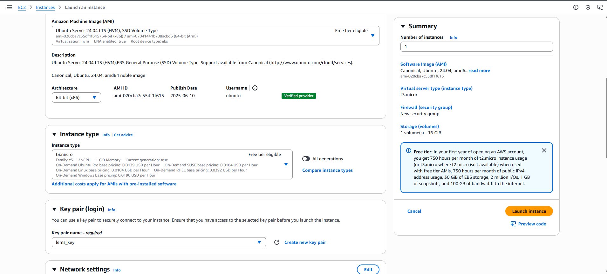
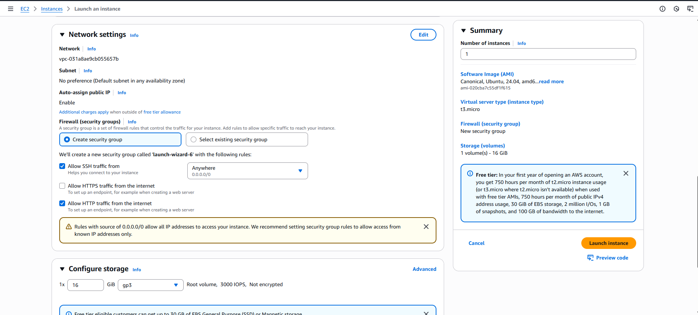
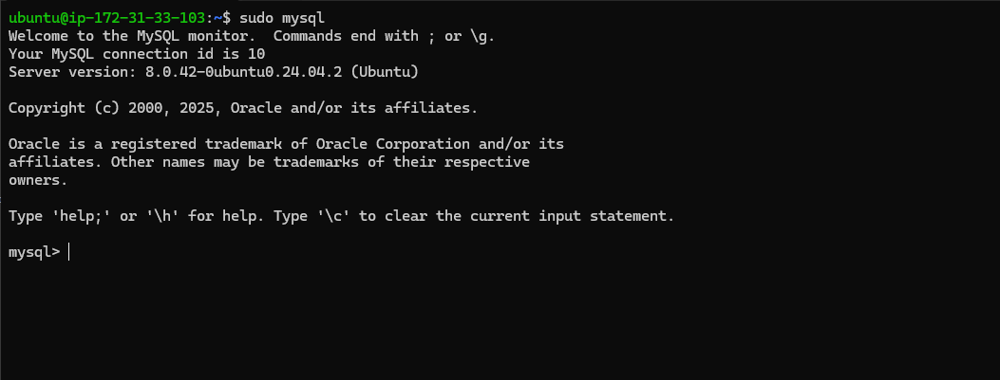

# LAMP on AWS EC2: Hands‑on Guide and Setup

This repository walks through provisioning an Ubuntu server on AWS EC2 and configuring a complete LAMP stack: Linux, Apache, MySQL, and PHP. The guide is written for learners and practitioners who want a clear, reproducible path from a fresh instance to a working web server.

---

## Contents

- Overview
- Architecture at a glance
- What you’ll use
- Prerequisites
- Step‑by‑step setup
- Testing your stack
- Hardening tips
- License and attribution

---

## Overview

The classic LAMP stack powers many dynamic sites and apps. In this walkthrough you will:

- Launch an Ubuntu EC2 instance
- Install and configure Apache
- Secure and configure MySQL
- Install PHP and required modules
- Create a simple site and enable a dedicated Apache virtual host

By the end, you’ll be able to browse to your EC2 public IP and see PHP executing on Apache, backed by MySQL.

---

## Architecture at a glance

```text
Client → Internet → AWS EC2 (Ubuntu) → Apache → PHP → MySQL
```

- Ubuntu (EC2)
- Security Group with HTTP(80), SSH(22), and optionally MySQL(3306)
- Apache HTTP Server
- MySQL Server
- PHP with MySQL integration

---

## What you’ll use

- AWS EC2 (Ubuntu 20.04/22.04)
- Apache2
- MySQL Server (8.x)
- PHP (7.4+ or 8.x) and extensions
- Bash shell
- Git (for version control)

---

## Prerequisites

- AWS account and an IAM user with EC2 permissions
- An SSH key pair (PEM)
- Basic Linux command‑line familiarity
- A browser to verify the website

---

## Step‑by‑step setup

### 1) Launch an EC2 instance

- Choose Ubuntu Server 20.04 or 22.04 LTS (t2.micro is fine for Free Tier)
- Open inbound rules for:
  - SSH (22) from your IP
  - HTTP (80) from anywhere
  - Optional: MySQL (3306) if you need remote DB access







### 2) Fix key permissions and connect over SSH

```bash
chmod 0400 your-key.pem
ssh -i your-key.pem ubuntu@<your-ec2-public-ip>
```

### 3) Update the system

```bash
sudo apt update && sudo apt upgrade -y
```

### 4) Install and verify Apache

```bash
sudo apt install -y apache2
```

Visit `http://<your-ec2-public-ip>` — you should see the Apache default page.

### 5) Install and secure MySQL

```bash
sudo apt install -y mysql-server
```

Enter the MySQL shell as root:

```bash
sudo mysql
```

Optionally switch the root account to the native password plugin and set a password:

```sql
ALTER USER 'root'@'localhost' IDENTIFIED WITH mysql_native_password BY 'P@ssw0rd';
FLUSH PRIVILEGES;
```

```sql
exit;
```

Run the secure setup script and follow the prompts:

```bash
sudo mysql_secure_installation
```

Log in to confirm:

```bash
sudo mysql -u root -p
```



### 6) Install PHP and extensions

```bash
sudo apt install -y php libapache2-mod-php php-mysql
php -v
```

### 7) Create a site and enable an Apache Virtual Host

Create a web root and give ownership to the current user:

```bash
sudo mkdir -p /var/www/projectlamp
sudo chown -R "$USER":"$USER" /var/www/projectlamp
```

Create a new virtual host definition:

```bash
sudo tee /etc/apache2/sites-available/projectlamp.conf >/dev/null <<'APACHECONF'
<VirtualHost *:80>
    ServerName projectlamp
    ServerAlias www.projectlamp
    ServerAdmin webmaster@localhost
    DocumentRoot /var/www/projectlamp
    ErrorLog ${APACHE_LOG_DIR}/error.log
    CustomLog ${APACHE_LOG_DIR}/access.log combined
</VirtualHost>
APACHECONF
```

Enable the site and disable the default:

```bash
sudo a2ensite projectlamp
sudo a2dissite 000-default
sudo apache2ctl configtest
sudo systemctl reload apache2
```

### 8) Prioritize index.php over index.html

Apache’s default `DirectoryIndex` prefers `index.html`. To make PHP pages load first, edit:

```bash
sudo nano /etc/apache2/mods-enabled/dir.conf
```

Move `index.php` to the front, for example:

```apacheconf
DirectoryIndex index.php index.html index.cgi index.pl index.xhtml index.htm
```

Then reload Apache:

```bash
sudo systemctl reload apache2
```

---

## Testing your stack

Create a simple PHP info page in your site root:

```bash
echo "<?php phpinfo(); ?>" | sudo tee /var/www/projectlamp/index.php
```

Open `http://<your-ec2-public-ip>` in your browser. You should see the PHP information page rendered by Apache.


Optional: Create a minimal HTML homepage (served when `index.php` is removed):

```bash
echo "<h1>Hello from LAMP on EC2</h1>" | sudo tee /var/www/projectlamp/index.html
```

---

## Hardening tips

- Remove `index.php` (phpinfo) after testing; it exposes environment details.

```bash
sudo rm /var/www/projectlamp/index.php
```

- Keep the system updated: `sudo apt update && sudo apt upgrade -y`
- Use strong MySQL credentials and restrict remote DB access if not required
- Consider enabling a firewall (UFW) to allow only needed ports

---

## License

MIT License

---

## Author

**Peter Lemule**  
[GitHub](https://github.com/JohnOkari) · [LinkedIn](https://www.linkedin.com/in/johnnokari-001/)
